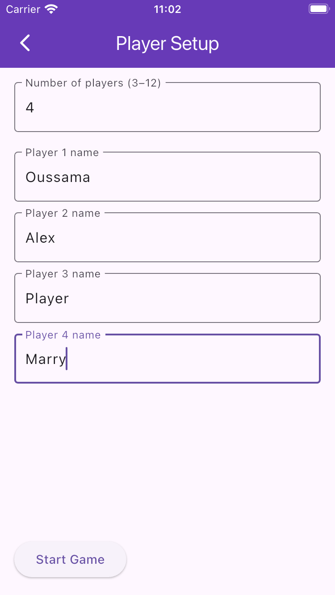
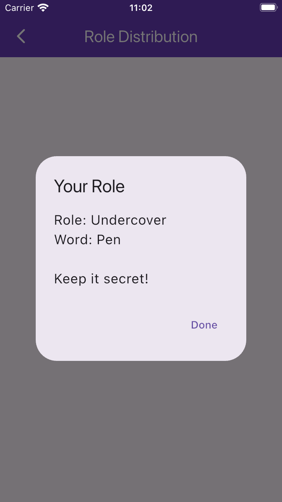
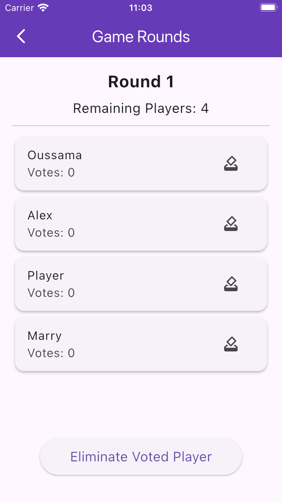
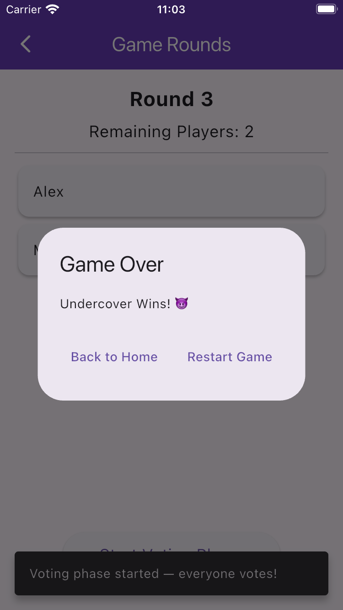

# Undercover Game Clone 🎭
A simple local multiplayer party game built in **Flutter**, inspired by the popular “Undercover” social deduction game.

---

## 📱 Overview

Each player receives a secret word — one player is the **Undercover** with a slightly different word.  
Everyone describes their word (without saying it), then votes on who they suspect is the Undercover.  
The game continues until the Undercover is discovered or only two players remain.

---

## 🚀 Features

✅ Player setup screen (3–12 players)  
✅ Random role and word pair assignment  
✅ Private role reveal per player  
✅ Voting and elimination logic  
✅ Tie handling (no elimination on tie)  
✅ Win conditions:
- Citizens win if the Undercover is eliminated
- Undercover wins if only two players remain  


---

## 🛠 How to Run

### Prerequisites
- Flutter SDK (3.x+)
- Xcode (for iOS) or Android Studio (for Android)
- A physical/emulator device connected

### Steps
```bash
# Clone this repository
git clone https://github.com/oussemahassine/undercover_game.git
cd undercover_game

# Get dependencies
flutter pub get

# Run on emulator or connected device
flutter run
```

---

## 📸 Screenshots

### 🧍‍♂️ Player Setup Screen


### 🎭 Role Distribution Screen


### 🗳️ Voting Phase


### 🏁 Game Over Screen



---

## 👨‍💻 Author
**Oussama Hassine**  
Master’s in AI & Informatics – University of Urbino Carlo Bo  
[LinkedIn](https://www.linkedin.com/in/oussemahassine)

---
